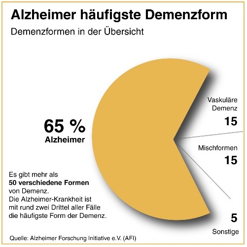

# Alois Alzheimer-Gedenktafel 

Diese Gedenktafel erinnert an Alois Alzheimer. Er stieß erstmalig auf anatomische 
Veränderungen im Gehirn einer Patientin, welche typisch für die später nach ihm benannte 
Erkrankung waren: Plaques, Fibrillen und ein verringertes Gehirnvolumen. [Hier](https://www.uni-frankfurt.de/66990042/Gedenktafel_für_Alois_Alzheimer) auf der Uni-
Website findest du noch weitere Informationen zu Alois Alzheimer.

Aber was weiß man heute über die Alzheimer-Krankheit - und was nicht? Hier findest du ein 
paar spannende Informationen dazu.

## Wusstest du, dass..

* etwa 1 % der Bevölkerung von einer Alzheimer-
Demenz betroffen ist?  

* es verschiedene Demenz-Formen gibt, s. Abbildung:

* auf anatomischer Ebene zwei Mechanismen (beta Amyloid-Plaques & TAU-Fibrillen) dazu beitragen, dass die Alzheimer-typischen Symptome 
Gedächtnisstörungen, Verwirrtheit, Sprachstörungen auftreten? Hier kannst du eine 3D-Animation dazu anschauen: Alzheimer: Eine 
dreidimensionale Entdeckungsreise - YouTube 


* dass diese Veränderungen im Hippocampus – dem Sitz des Gedächtnisses – zuerst auftreten und deswegen Gedächtnisprobleme bereits im Frühstadium von Alzheimer auftreten? 

* es bislang keine Heilung für die Erkrankung gibt, da die Ursache(n) für das Auftreten von Alzheimer immer noch nicht gefunden wurden?  

* Alzheimer nur zu einem geringen Maße erblich ist? 

* es verschiedene Theorien zur Entstehung von Alzheimer gibt? 
 
  * Manche Forscher:innen gehen davon aus, dass chronische Viruserkrankungen wie bspw. Hepatitis C, Bakterien oder Pilze die Entstehung von Alzheimer auslösen könnten.  

  * Die Rolle bestimmter Metalle wie z. B. Aluminium, die durch Nahrung, 
Kosmetik, etc. aufgenommen werden, wird ebenfalls weiterhin diskutiert, 
konnte bislang aber nicht bestätigt werden. 

* das Auftreten von Alzheimer zum Teil verhindert werden kann, wenn das Gehirn im 
Alter weiterhin gefordert wird? Beispielsweise durch das Lernen neuer Informationen 
(z.B. eine neue Sprache), Gedächtnisübungen, soziale Aktivitäten, gesunde 
Ernährung, körperliche Aktivität, usw. 
 
 

### Nächste Station: _WORT//WORT//WORT_   

