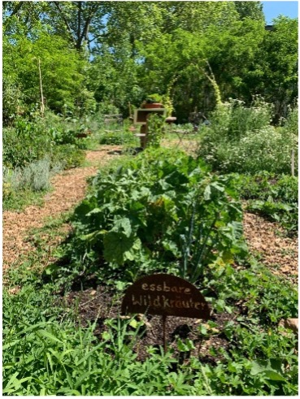
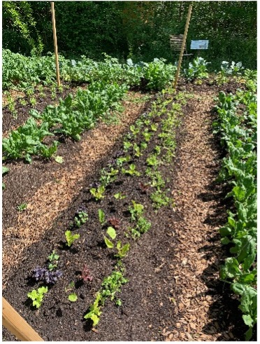
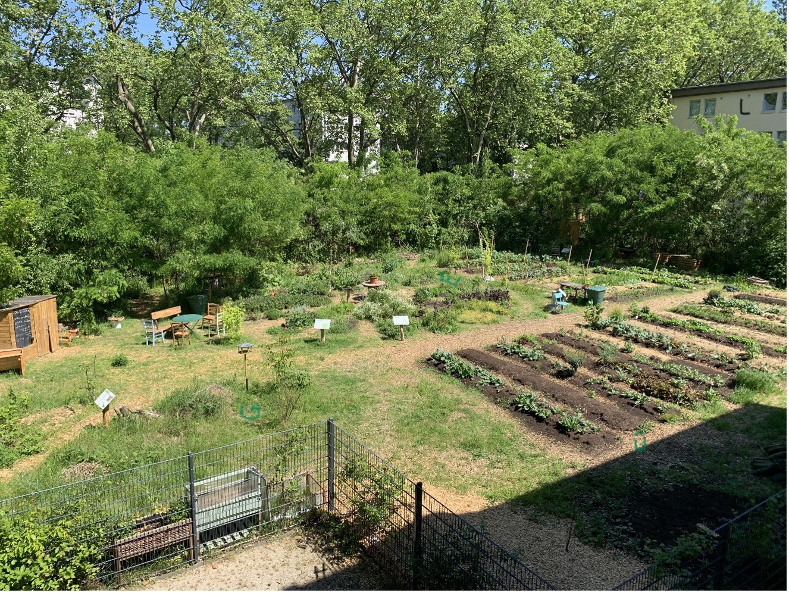
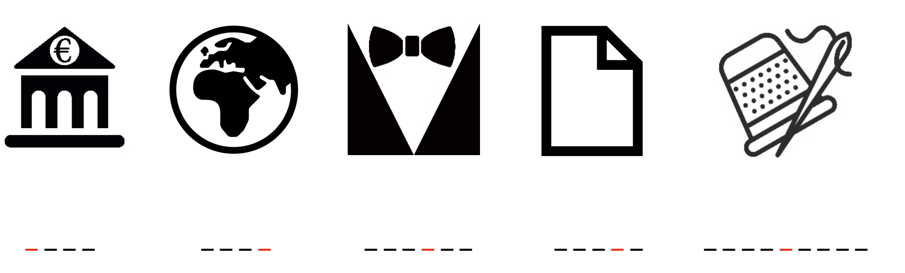

# Campus Garten

    

Schön, dass du den Campus-Garten gefunden hast! Hier bauen Studierende und Anwohner:innen gemeinsam nach den Prinzipien der Permakultur Gemüse an. 

Im Interview hat uns David Delto von Goethes Green Office unter anderem erzählt, was es dort alles zu entdecken gibt.
<figure>
    <figcaption>Interview mit David Delto zum Campus Garten:</figcaption>
    <audio
        controls
        src="CampusGarten.mp3">
            Your browser does not support the
            <code>audio</code> element.
    </audio>
</figure>
_Interview durchgeführt von Hanna Barner_

Hier siehst du den Campus Garten von oben. Wir haben 5 Buchstaben darin versteckt, die die erste Hälfte des Lösungswortes ergeben. Findest du sie?

Die Bildchen unten zeigen alle ein Teekesselchen. Das sind Wörter, die zwei verschiedene Bedeutungen haben. Eine Bedeutung ist auf dem Bild dargestellt, die andere bezieht sich auf Dinge, die man in einem Garten finden kann. Die roten Buchstaben geben dann den zweiten Teil vom Lösungswort. 

### Nächste Station: _WORT//WORT//WORT_   

