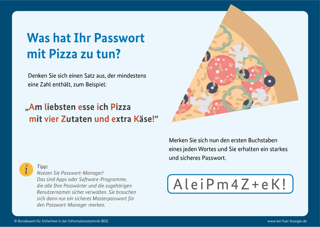

# Information Security Overconfindence

Die Gefahr durch Sicherheitsvorfälle ist stark gestiegen. Jeder dritte gezielte Sicherheitsangriff ist erfolgreich und gleichzeitig halten die meisten Mitarbeiter ihr Unternehmen für ziemlich sicher. 
Clara Ament hat sich mit der Frage beschäftigt, ob Mitarbeiter dazu neigen, sich selbst zu überschätzen. Die Ergebnisse werden dich möglicherweise dazu bringen, Dein eigenes Verhalten zu hinterfragen.

Zu Beginn ein paar Worte zum Thema Overconfidence. Was bedeutet das überhaupt?
Overconfidence bedeutet Selbstüberschätzung und meint eine kognitive Verzerrung, die sich in einer systematisch inkorrekten Einschätzung des eigenen Wissens und der eigenen Fähigkeiten sowie einer falschen Wahrnehmung manifestiert, ungewisse zukünftige Ereignisse kontrollieren zu können. Oder kurz: Overconfidence bedeutet, dass sich Menschen ziemlich sicher sind, indem was sie tun und wie sie es tun. 

## Theoretischer Ansatz
Nun zur eigentlichen Forschungsfrage. Im Kontext von Overconfidence bei Informationssicherheit wird ein mehrschichtiger Ansatz vorgeschlagen bestehend aus:

### Overestimation
Individuen überschätzen ihre eigenen Fähigkeiten, Leistungen, Kontrollmöglichkeiten, oder Erfolgschancen. 

### Overprecison 
Individuen sind sich ihrer selbst zu sicher und legen zu enge Konfidenzintervalle fest.

### Overplacement
Individuen fühlen sich anderen überlegen (relative Selbstüberschätzung)

**Kurz und knapp:** Menschen überschätzen sich, sind sich dabei ihrer selbst ziemlich sicher und glauben dann auch noch sie sind besser als alle anderen.

## Methode
Ziemlich naheliegend, es braucht Daten, um die Forschungsfrage zu beantworten. Insgesamt wurden 260 Mitarbeiter eines Online-Arbeitsmarktes befragt. Die Teilnehmer mussten mehrere Multiple-Choice-Fragen zur Informationssicherheit beantworten. Es gab sowohl einen Test mit leichten Fragen als auch einen mit hohem Schwierigkeitsgrad. Die  Fragen wurden natürlich vorher von Informationssicherheitsprofis bewertet und durch Pre-Tests validiert. 

**Und was kam raus?**

## Ergebnisse
Menschen neigen dazu, ihr Wissen bezüglich Informationssicherheit zu überschätzen. Das betrifft sowohl Overestimation, Overprecision und (teilweise) Overplacement und das gilt vor allem für Personen mit geringem Informationssicherheitswissen.
Es konnte gezeigt werden, dass die Probanden ihre Leistungen in beiden Tests im Schnitt überschätzen (Overestimation).
Auch sind sie übergenau hinsichtlich der Bewertung ihrer Leistung in beiden Tests (Overplacement). Außerdem haben die Probanden im leichten Test im Schnitt ihre Leistung gegenüber der Leistung anderer überschätzt. (Overplacement)

Zusammenfassen haben vorallem die Probanden, die nicht viel Ahnung von Informationssicherheit haben, ziemlich sicher geglaubt, sie wissen genug über Informationssicherheit und das besser als alle anderen.

## Take-aways

Information Security Overconfidence existiert und ist ein großes Risiko für Firmen!

Es gibt drei Arten von Information Security Overconfidence: Menschen überschätzen ihre Leistungen (overestimation). Sie sind sich ihrer Fähigkeiten zu sicher (overprecision). Und sie sind davon überzeugt, dass sie besser als alle anderen sind (overplacement).

Selbstüberschätzung kann schwerwiegende Konsequenzen haben. 

