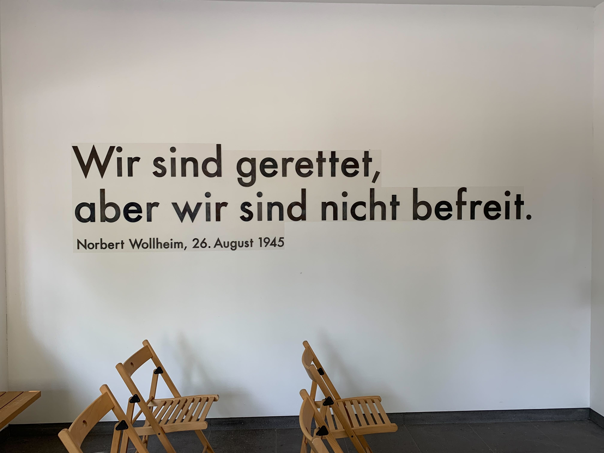
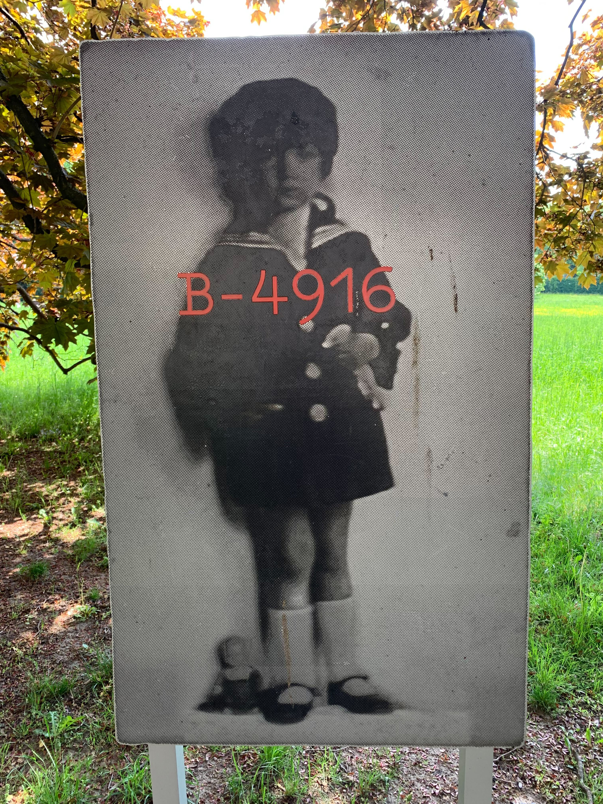
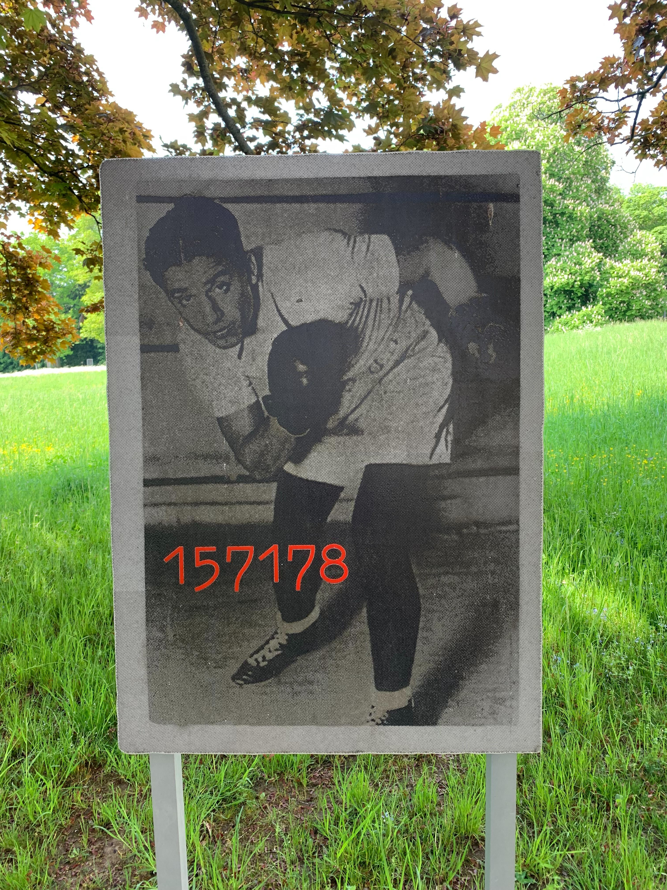

# Wollheim Pavillon

Hier: Exposé von Veronika Duma folgt Ende Juni

Lust auf ein [Kreuzworträtsel?](https://www.xwords-generator.de/de/solve/dshbk) Es verbindet Fragen zu Wollheim und allgemeine Fragen zum Holocaust, damit du dein Wissen überprüfen kannst. Die teils dazu nötigen Informationen findest Du auf den Bildschirmen im Wollheim-Pavillon oder [online](http://www.wollheim-memorial.de/de/home). Am Ende erhältst du ein Lösungswort, das du hier zur Prüfung eingeben kannst:
<form name="f3">
  Lösungswort (GROßBUCHSTABEN) <input type="text" name="studentAnswer" size="20">
   
   
  <input type="button" value="Check" onClick="checkAnswers3()">

</form>

<iframe src="https://www.xwords-generator.de/de/solve/dshbk"><a href="https://www.xwords-generator.de/de/solve/dshbk">Kreuzworträtsel online lösen</a> width="700" </iframe>

Weitere Information findest du auf der [Webseite des Wollheim Pavillons ](http://www.wollheim-memorial.de/de/home)und auf der Webseite des [Fritz Bauer Institutes](https://www.fritz-bauer-institut.de).

### Wie heißen die Kinder? Finde es heraus, indem Du die Tafeln vor dem IG-Farbenhaus suchst.

<h3>Wer ist auf diesem Foto zusehen?</h3>
<form name="f1">
  Vorname Nachname: <input type="text" name="studentAnswer" size="20">
   
   
  <input type="button" value="Check" onClick="checkAnswers1()">

</form>

<h3>Wer ist auf diesem Foto zusehen?</h3>
<form name="f2">
  Vorname Nachname: <input type="text" name="studentAnswer" size="20">
   
   
  <input type="button" value="Check" onClick="checkAnswers2()">

</form>

### Nächste Station: _WORT//WORT//WORT_   

