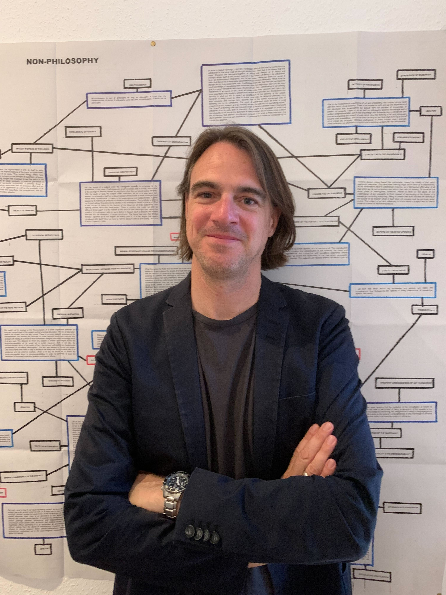

# Adornos Schreibtisch 

    

Falls dies deine erste Station der Campus Tour ist und Du noch nicht weißt, was dich erwartet und wie der Ablauf ist, dann kannst Du auf unserer [Startseite](https://campus-tour.github.io/) alles Wichtige nachlesen! Falls Du dich allerdings schon auskennst, dann kannst Du mit hier direkt weitermachen, viel Spaß!  

Vor dir siehst du das Adorno-Denkmal, das anlässlich zum 100. Geburtstag von Adorno 2003 in Bockenheim eingeweiht wurde. Seit 2016 steht es hier auf dem Campus Westend. Um mehr über Adorno zu erfahren und einen Einstieg in sein Denken zu erhalten, haben wir für dich einen Adorno-Kenner, Prof. Dr. Martin Saar (hier unten auf dem Foto zu sehen) interviewt. Hör gerne rein! 

Prof. Dr. Martin Saar ist seit 2017 Professor für Sozialphilosophie an der 
Goethe-Universität und Mitglied in Kollegium und Institutsrat am Institut 
für Sozialforschung. 

Er wirkt mit im Forschungsverbund „Die 
Herausbildung normativer Ordnungen“ und in der Forschungsinitiative 
„Vertrauen im Konflikt. Politisches Zusammenleben unter Bedingungen 
der Ungewissheit“. Seine Arbeitsschwerpunkte beziehen sich auf die 
Politische Ideengeschichte der frühen Neuzeit, die Geschichte und 
Gegenwart der Kritischen Theorie und die neuere französische 
Philosophie, auf Fragen der Macht, der Demokratie und des Subjekts.  
Wichtigste Veröffentlichungen: Genealogie als Kritik. Geschichte und 
Theorie des Subjekts nach Nietzsche und Foucault, Frankfurt am 
Main/New York 2007; Sozialphilosophie und Kritik, Frankfurt am Main 2009
(hg. mit Rainer Forst, Martin Hartmann und Rahel Jaeggi); Die Immanenz 
der Macht. Politische Theorie nach Spinoza, Berlin 2013 (2. Aufl. 2019); 
Das Politische (in) der Politischen Theorie, Baden-Baden 2021 (hg. mit 
Oliver Flügel-Martinsen und Franziska Martinsen).

<figure>
    <figcaption>Interview mit Prof. Dr. Martin Saar:</figcaption>
    <audio
        controls
        src="Adorno_Interview.mp3">
            Your browser does not support the
            <code>audio</code> element.
    </audio>
</figure>
_Interview durchgeführt von Sophia Corell_

Hast du anschließend Lust auf ein [Buchstabenrätsel?](https://puzzel.org/de/wordseeker/play?p=-N2WQ-WxgjMHpBN8dCs8) Es gilt, 10 Begriffe 
rund um Adorno in dem Buchstabenwirrwarr zu finden. Sie verstecken sich
waagerecht, senkrecht und diagonal. Klicke einfach den ersten und letzten 
Buchstaben des Wortes an und wenn es richtig ist, wird es in der Liste der 
gesuchten Wörter durchgestrichen. Viel Spaß!
Den Lösungsbuchstaben dieser Station findest Du an dritter und letzter Stelle in dem Namen von Adornos Kollegen, dem Direktor des Instituts für Sozialforschung (PS: Der Name ist einer der 10 Begriffe aus dem Buchstabenrätsel).

Mehr zu dem Adorno-Denkmal, findest du [hier](https://www.uni-frankfurt.de/66990032/adorno-denkmal). Dort werden weiterführende Literaturangaben gemacht.
Und falls du gerne mehr zu Adornos Leben erfahren möchtest, klicke [hier](https://www.hdg.de/lemo/biografie/theodor-w-adorno.html). Eine Darstellung seiner Theorie findet sich ausführlich auf der Website der [Stanford Encyclopedia of Philosophy](https://plato.stanford.edu/entries/adorno/). Viel Spaß beim Stöbern!
### Nächste Station: _WORT//WORT//WORT_   

