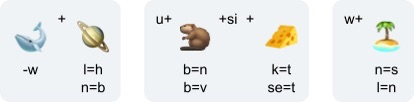

## Body of Knowledge

    

Falls dies deine erste Station der Campus Tour ist und Du noch nicht weißt, was dich erwartet und wie der Ablauf ist, dann kannst Du auf unserer [Startseite](https://campus-tour.github.io) alles Wichtige nachlesen! Falls Du dich allerdings schon auskennst, dann kannst Du hier direkt weitermachen, viel Spaß!  

Eindrucksvoll, oder? Vor dir siehst Du den __Body of Knowledge__ des spanischen Künstlers Jaume Plensa.         

Ganze 8 Meter ist der Body of Knowledge hoch und setzt sich zusammen aus einzelnen Buchstaben acht verschiedener Sprachen.  

Ein Zitat des Künstlers selbst beschreibt sehr gut, was der Body of Knowledge und die Universität ausmacht: 

_„Unser Körper ist der Sitz des Geistes. Die Universität ist eine Ausweitung unseres Körpers. 
Ein Versammlungsort, an dem sich Menschen und Ideen, Tradition und Zukunft zu Zwiegesprächen treffen und das Netz menschlichen Wissens weben.“_ 
Jaume Plensa [(Quelle)](https://www.kunst-im-oeffentlichen-raum-frankfurt.de/de/page28.html?id=433)
 
Weitere Skulpturen von Jaume Plensa findest Du [Hier.](https://jaumeplensa.com/works-and-projects/sculpture)



Lust auf ein kleines Bilderrätsel? Ein Rebus besteht aus mehreren Bildern oder Zeichen (hier Emojis). Die Begriffe, die durch die Emojis repräsentiert werden, müssen aneinandergefügt werden, dabei müssen Buchstaben ausgetauscht, entfernt oder hinzugefügt werden. Auf diesem Weg entsteht ein neuer Begriff. 
Nutze die Hinweise und überprüfe Deine Antwort, indem Du sie in den zugehörigen Kasten eingibst. 

<form name="f1">
  Wort 1: <input type="text" name="studentAnswer" size="20">
   
   
  <input type="button" value="Check" onClick="checkAnswers1()">
   
   
</form>

<form name="f2">
  Wort 2: <input type="text" name="studentAnswer" size="20">
   
   
  <input type="button" value="Check" onClick="checkAnswers2()">
   
   
</form>

<form name="f3">
  Wort 3: <input type="text" name="studentAnswer" size="20">
   
   
  <input type="button" value="Check" onClick="checkAnswers3()">
  
  
</form>

Der Lösungsbuchstabe für diese Station ist der Anfangsbuchstaben des letzten Rebus-Wortes.

Hast Du Lust,auch einen Rubus zu erstellen? [Hier findest du einen kostenlosen Rebus-Generator.](https://rebus.club/de)

### Nächste Station: _WORT//WORT//WORT_   

