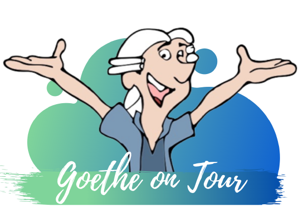

# Casino Mensa

    

Falls dies deine erste Station der Campus Tour ist und Du noch nicht weißt, was dich erwartet und wie der Ablauf ist, dann kannst Du auf unserer [Startseite](https://campus-tour.github.io) alles Wichtige nachlesen! Falls Du dich allerdings schon auskennst, dann kannst Du hier direkt weitermachen, viel Spaß!  

Super, Du hast es zu der Station Casino Mensa geschafft! Du stehst direkt vor einer der 13 Cafeterien und Mensen auf dem Campus Westend. Hier hast Du die Wahl zwischen verschiedensten Speisen und Getränken – ganz gleich, ob Du lieber tierische, vegetarische oder vegane Speisen bevorzugst – für so gut wie jede Ernährungsweise ist hier eine passende Speise dabei! 

Um Ernährungsweisen und dessen Folgen auf das soziale Umfeld geht es auch im nächsten Rätsel. 
### Aufgabe: 
Finde mittels des Rückwärtstexts heraus, welche der Aussagen nicht zutrifft. Der Buchstabe der falschen Aussage ist der Lösungsbuchstabe dieser Station.

.driw nrednärev gitlahhcan gnuguezrelettimsnebeL red tkraM ned dnu driw neleips elloR ehciltnesew enie tfnukuZ rehan ni hcua esiewsgnurhänrE enagev enie ssad ,ssulhcS med uz eppurgsgnuhcsroF eid tmmok tmasegsnI .nereimusnok etkudorP ehcsireit eid ,nenosreP eiwos ,trhänre hcsirategev redo nagev hcis eid ,nosreP enie snetsednim dlefmU negne merhi uz neröheg tsieM .nebegmu nehcsneM nedneknedhcielg nov hcilßeilhcssua thcin nenni*renageV dnis nednessE llenoitidart dnu nenni*renageV nehcsiwz netiekgireiwhcS rehcilgöm ztorT .nlednahuzsua nevitanretlA dnu nereimrofni uz esiewsgnurhänrE enegie eid rebü eredna barov ,gnutuedeB reßorg nov se ies reiH .nednibrev uz sdlefmU serhi negnutrawrE tim esiewsgnurhänrE erhi ,tlläfrewhcs dneballirG menie eiw nessälnA nerednoseb ieb nenni*renageV se ssad ,suareh hcis tllets sweivretnI ned nI .rad sinredniH niek tfo nenni*renageV rüf mroN eseid tllets gatllA mI .nessüm negitrefthcer redo nerälkre esiewsgnurhänrE erhi retfö nenni*renageV blahsew ,tgarfretnih nednehetsneßuA nov regißämleger rehad driw dnu mroN eid thcin hcon rehsib tsi esiewsgnurhänrE enagev eniE .tnhowegnu nednessE llenoitidart eid rüf raw kcurdsgnugitrefthceR enednatstne hcärpsegtiertS mi reD .dnis netareg evisnefeD eid ni hcua nrednos ,neraw negelretnu vitatnemugra run thcin ,nereimusnok etkudorP ehcsireit eid ,nehcsneM ssad ,suareh hcis etllets llenhcS .nednürgeb uz esiewsgnurhänrE erhi ,netebeg nednemhenlieT eid nedruw hcärpsegtiertS netreinezsni mI .nenni*renageV dnu nednereimusnokhcsielF nehcsiwz hcärpsegtiertS nie etreinezsni dnu sweivretnI evitatilauq neppurgsgnuhcsroF ierd red enie etztun rüfreiH .thcusretnu nehcsneM nednebel nagev thcin dnu nehcsneM nednebel nagev nehcsiwz nekimanyD elaizos niaM ma trufknarF tätisrevinU ehteoG red ednereidutS nebah reuabgetS naitsirhC rosseforP nov sranimeS nehcsigoloizosstfahcstriw senie nemhaR mI

### Welche Aussage trifft NICHT zu?
A) Im inszenierten Streitgespräch waren die Teilnehmenden, die tierische Produkte konsumieren, den veganen Teilnehmenden argumentativ überlegen.  
B) Im persönlichen Umfeld von vegan Ernährenden befinden sich auch viele Menschen, die eine ähnliche Ernährungsweise nicht teilen.  
C) Insbesondere im gesellschaftlichen Leben geraten Veganer*innen aufgrund sozialer Erwünschtheit häufig in schwierige Situationen, in denen sie Kompromisse in ihrer Ernährungsweise eingehen.  
D) Eine Ernährung mit tierischen Produkten wird bisher als „normal“ angesehen, wodurch Fleischkonsumierende weniger mit ihrer Ernährungsweise konfrontiert werden und seltener in Rechtfertigungssituationen geraten. 

Für einen ausführlicheren Einblick in das Forschungsprojekt unter Leitung von Prof. Christian Stegbauer siehe: 
Windscheid, N.; Schöngarth, S.; Becker, S.; Aksoy, H. und Stegbauer, C. (2020): Ausbreitung des Veganismus. Wirtschaftssoziologisches Seminar untersucht vegetarische und vegane Konsumgewohnheiten. Unireport, 2(20), 7. https://www.unireport.info/87452345.pdf 

Hat das Lösen des Rätsels Deinen Hunger oder Durst geweckt? Dann bietet sich die Mensa Casino wunderbar für eine kleine Rast an! 

### Nächste Station: _Wort//Wort//Wort_

