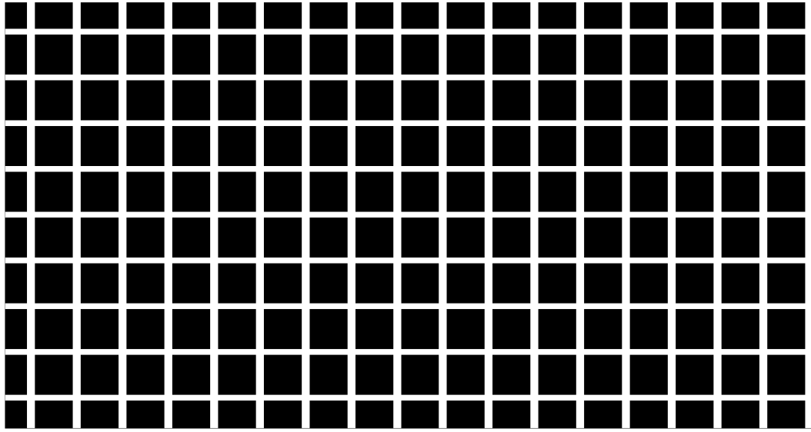
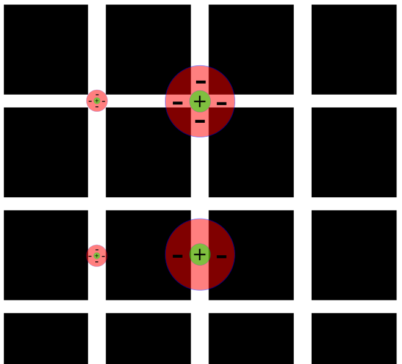
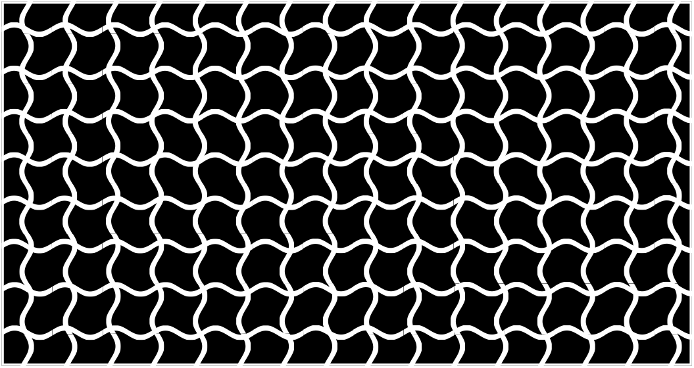

# Eiskeller

    

Falls dies deine erste Station der Campus Tour ist und Du noch nicht weißt, was dich erwartet und wie der Ablauf ist, dann kannst Du auf unserer [Startseite](https://campus-tour.github.io) alles Wichtige nachlesen! Falls Du dich allerdings schon auskennst, dann kannst Du hier direkt weitermachen, viel Spaß!  

___

## Irrenschloss: Eiskeller
Du befindest dich hier an der Station “Eiskeller” im Gebäude der Psychologie, Erziehungswissenschaften und Gesellschaftswissenschaften (PEG-Gebäude). Der Name “Eiskeller” beruht auf den Mauerresten, die bei Bauarbeiten auf dem Campus Westend im Jahre  2008 in der Lübecker Straße entdeckt wurde, das wahrscheinlich als Eiskeller, also Lagerstätte für Eisblöcke, durch eine Psychiatrie genutzt wurde. Es wurde beim Neubau in die gesellschafts- und erziehungswissenschaftliche Bibliothek integriert und ist auch heute noch zu sehen. Heinrich Hoffmann (Autor des Struwwelpeter) war von 1851-88 Direktor dieser„Anstalt für Irre und Epileptische“. Er veranlasste einen Neubau der Psychiatrie auf dem „Affensteiner Feld“ im Westend, dem heutigen Gelände des Westend-Campus. Eine weitere bekannte Persönlichkeit, die mit dieser Psychatrie in Verbindung steht, ist Alois Alzheimer, der Assistenzarzt in dieser Psychiatrie war und hier seinen ersten Fall der Alzheimer-Krankheit entdeckte.Die Psychiatrie wurde 1928 abgerissen und das Gelände wurde später von der IG-Farben gekauft, die auf dem Gebiet das IG-Farben Haus erbaute. [8]

Heutzutage wird am PEG-Gebäude unter anderem psychologische Forschung betrieben und Studierende werden werden die vielfältigen Seiten der Psychologie gelehrt. Dazu gehören beispielsweise…

## Optische Täuschungen
Im Folgenden ist eine optische Täuschung zu sehen, die als Hermann-Gitter bekannt ist. (Abbildung abgewandelt nach Bach [1])

Beim Blick auf das Gitter sind in der Peripherie graue Flecken zu sehen, die jedoch nicht im Zentrum des Blickes auftreten. Richtet man den Blick nun auf diese grauen Flecken, verschwinden diese wieder im Zentrum des Blickes und erscheinen in der Peripherie. Ludimar Hermann [2] entdeckte diese optische Täuschung im Jahre 1870, deren Erklärung bis 1960 zunächst verborgen blieb und später nochmal widerlegt wurde. In diesem Jahr schlug Baumgartner vor, dass die Hermann-Gitter-Täuschung auf den zirkulären rezeptiven Feldern von Ganglienzellen zurückzuführen sei [3]. 

Diese besitzen im Zentrum einen aktivierenden Bereich und im äußeren Ring einen hemmenden Bereich. An Kreuzungsstellen wird vierfach gehemmt, während entlang einer Linie nur zweifach gehemmt wird, sodass nur an Kreuzungsstellen graue Flecken auftreten. Im Zentrum des Blickes hingegen fällt das Licht auf die Fovea, welche eine bessere Auflösung durch kleinere rezeptive Felder besitzt, sodass der Effekt hier nicht zu sehen ist [1].

Diese Erklärung wurde später widerlegt, da dieses Modell nicht erklären kann, weshalb die Hermann-Gitter-Täuschung durch sinusoidale Linien verschwindet [4]. Probier es aus: Ein Klick auf das Bild wechselt zwischen den geraden und wellenförmigen Linien. Ein neues Modell von Corney und Lotto [5] erklärt die Hermann-Gitter-Täuschung mit der Informationsverarbeitung auf höherer Ebene durch Untersuchung an einem künstlichen neuronalen Netz, sodass streng genommen vielleicht nicht von einer “optischen” Täuschung gesprochen werden kann.

## Verschwörungsmythen
- Wer?:  Der Glaube an Verschwörungsmythen ist gleich häufig verteilt über alle Altersgruppen, Berufsgruppen und zwischen Ost- und Westdeutschland. Zugänglicher für diese sind Menschen mit rechter und rechtspopulistischer politischer Einstellung, mit vglw. niedrigerem Bildungsniveau und Personen, die sich als sozial und wirtschaftlich schlechter gestellt wahrnehmen – dies aber rein objektiv meist gar nicht sind. [6]
- Was?:  Inhalte von Verschwörungsmythen sind häufig geprägt durch Misstrauen gegenüber höhergestellten Institutionen und Personen, sog. „Eliten“. [6]
- Wie?: Filterblasen in sozialen Medien können die Radikalisierung mithilfe von Verschwörungsmythen beschleunigen, insbesondere Videos können gezielter Emotionen ansprechen und sind so zugänglicher. [6]
- Warum?: Psychologisch gesehen hilft die Beschäftigung mit Verschwörungsmythen bzw. der vermeintliche Erkenntnisgewinn durch diese, einen subjektiven Kontrollverlust auszugleichen. Sie können sinnstiftend, unterhaltsam und spannend wirken. Außerdem können sie gezielt dazu eingesetzt werden, bestimmte Personengruppen zu radikalisieren, z.B. um Wahlverhalten zu beeinflussen, demokratiefeindliche Dynamiken zu unterstützen und Gewalt zu rechtfertigen. [6][7]
- Was kann ich dagegen tun?
    * Keine Falschmeldungen replizieren, sondern stattdessen ohne deren erneute Verbreitung über die tatsächlichen Verhältnisse aufklären [6]
    * Haltung zeigen gegen simplifizierende und häufig auch rassistische oder antisemitische Verschwörungserzählungen [6]
    * Sich selbst informieren, persönliche Gespräche suchen statt Schriftverkehr [6]
    * Im Zweifelsfall Beratungsstellen aufsuchen [6]:
        + Amadeu Antonio Stiftung: https://www.amadeu-antonio-stiftung.de/verschwoerungsmythen-und-antisemitismus/anlaufstellen-und-beratungsangebote/
        + Veritas Beratung: https://veritas-beratung.de/
        + mobile Beratungsstellen gegen Rechtsextremismus Hessen: https://mbt-hessen.org/
        + HateAid: https://hateaid.org/betroffenenberatung/
        + Sektenberatungsstellen in Frankfurt: https://jugendschutz-frankfurt.de/sekten.html

  
### Nächste Station: _///blende.digitalen.angehängt_
  
### Referenzen  
[1] Bach, M. (2009). The hermann grid illusion: The classic textbook interpretation is obsolete. Der Ophthalmologe: Zeitschrift Der Deutschen Ophthalmologischen Gesellschaft, 106(10), 913–917. https://doi.org/10.1007/s00347-008-1845-5  
[2] Baumgartner, G. (1960). Indirekte Größenbestimmung der rezeptiven Felder der Retina beim Menschen mittels der Hermannschen Gittertäuschung. Pflügers Archiv Für Die Gesamte Physiologie Des Menschen Und Der Tiere, 272(1), 21–22. https://doi.org/10.1007/bf00680926  
[3] Corney, D., & Lotto, R. B. (2007). What are lightness illusions and why do we see them? PLoS Computational Biology, 3(9), e180. https://doi.org/10.1371/journal.pcbi.0030180  
[4] Geier, J., Bernáth, L., Hudák, M., & Séra, L. (2008). Straightness as the main factor of the hermann grid illusion. Perception, 37(5), 651–665. https://doi.org/10.1068/p5622  
[5] Hermann, L. (1870). Eine Erscheinung simultanen Contrastes. Pflügers Archiv Für Die Gesammte Physiologie Des Menschen Und Der Tiere, 3(1), 13–15. https://doi.org/10.1007/bf01855743  
[6] Lamberty, P. (2019). Verschwörungsmythen als Radikalisierungs-beschleuniger: Eine psychologische Betrachtung. Die Erde.  
[7] van Prooijen, J. W. (2022). Psychological benefits of believing conspiracy theories. Current Opinion in Psychology, 47, 101352. http://dx.doi.org/10.1016/j.copsyc.2022.101352.  
[8] Frankfurt Humanities Research Centre. (n.d.). Goethe-Universität — Der Eiskeller auf dem Affenstein. www.uni-Frankfurt.de. Retrieved June 27, 2022, from https://www.uni-frankfurt.de/67654109/Der_Eiskeller_auf_dem_Affenstein

‌
