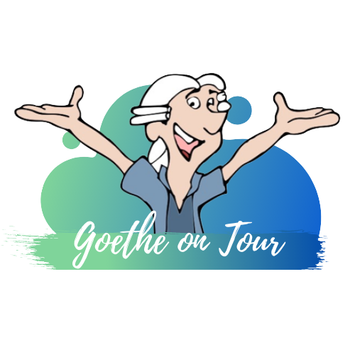

# Harry Potter-Bibliothek

    

Falls dies deine erste Station der Campus Tour ist und Du noch nicht weißt, was dich erwartet und wie der Ablauf ist, dann kannst Du auf unserer [Startseite](https://campus-tour.github.io) alles Wichtige nachlesen! Falls Du dich allerdings schon auskennst, dann kannst Du hier direkt weitermachen, viel Spaß!  

Bücher über Bücher in verworrenen Gängen findet man im ersten und zweiten Obergeschoss der Bibliothek des Fachbereichs Germanistik im Querbau 1 des IG Farbengebäudes. Bereits auf dem Weg in die Bibliothek fühlt man sich ein bisschen wie in der Hogwarts Schule für Hexerei und Zauberei. Zwar schwingen hier keine magischen Treppen hin und her, die den Weg zum Ziel verkomplizieren, doch der Eingang über das dritte Obergeschoss zu einer Bibliothek, die sich im ersten und zweiten Obergeschoss befindet, macht den Weg in die besondere Bibliothek schon etwas ungewöhnlich. Doch von Studierenden wird die Bibliothek aus einem anderen Grund als „Harry Potter Bibliothek“ bezeichnet. Wenn du schon in anderen Bibliotheken der Goethe Universität warst, wird dir hier sicher ein Unterschied auffallen, oder? Kaum tritt man ein fühlt man sich wie an einem magischen Ort, entworfen nach einer Beschreibung aus der Feder J. K. Rowlings. Denn die Gestaltung der Bibliothek erinnert sehr an die Schulbibliothek der Hogwarts Schule für Hexerei und Zauberei, wo die Bibliothekarin Irma Pince über die vielen langen Regale voller Zauberbücher der verschiedensten Fachrichtungen wacht. Nur dass man hier anstelle von Schulbüchern über die Verteidigung gegen die dunklen Künste oder Bibliografien bedeutender Hexen und Zauberer wie Nicolas Flamel Werke aus dem Altbestand der Germanistik findet. Vielleicht hast Du aber auch Glück und findest in dem ein oder anderen Märchenbuch etwas über Hexerei und Zauberei und das Hexenwesen…
 

*Ron*: Alchemie, Runenkunde, Astronomie, … Hermine wie viele Zusatzfächer willst du noch belegen?  

*Hermine*: Du hast Muggelkunde vergessen. Tatsächlich ein sehr spannendes Fach. Eigentlich hatte ich es nur belegt, um zu erfahren, wie Hexen und Zauberer die Welt der Muggel betrachten. Doch wir sprechen über viele spannende Themen und knüpfen auch Verbindungen zu anderen Fächern wie Geschichte der Zauberei.  

*Ron*: Geschichte… spannend…  

*Hermine*: Würdest du in Geschichte der Zauberei nicht immerzu schlafen würdest du vielleicht auch erkennen, wie interessant der Unterricht ist!  

*Harry*: Was für Verbindungen findest du denn spannend? Hast du ein Beispiel?  

*Hermine*: Wie gut, dass du fragst, Harry! Wenigstens einer von euch beiden ist interessiert daran, sich weiterzubilden… Erst letzte Woche haben wir das Hexenwesen aus Sicht der Muggel thematisiert und dabei viel über die von Muggeln praktizierte Pharmazie gesprochen.  

*Ron*: Pharmazie? Ist das was zu essen?  

*Hermine*: Ron, du würdest gut daran tun etwas mehr zu LESEN… Pharmazie ist eine interdisziplinäre Wissenschaft der Muggel, die sich unter anderem mit der Herstellung von Arzneimitteln befasst. Du kannst es mit Kräuterkunde oder Zaubertränke vergleichen. Da die Muggel sich keiner Zauberei bedienen können, studieren sie die Natur und nutzen ihr Wissen, um Krankheiten mit Hilfe der Naturwissenschaften zu heilen, also mit Hilfe der Chemie, Biologie und Physik.  

*Harry*: Aber was hat denn die Pharmazie mit Hexen und Zauberern zu tun?  

*Hermine*: Ihr wisst ja sicherlich, wie sich die Muggel Hexen vorstellen, oder?  

*Harry*: *hust* Tante Petunia *hust*  

*Ron*: Haha ja, die käme dem schon sehr nahe. Fehlt nur noch die Warze auf der Nase!  

*Hermine*: Jungs…   

*Harry*: Tschuldigung.  

*Ron*: Tschuldigung. Was genau war nochmal die Frage?  

*Hermine*: Wie stellen sich Muggel Hexen vor?  

*Harry*: Naja also womit die Muggel schonmal recht haben ist unsere Vorliebe für das Fliegen auf Besen!  

*Hermine*: Stimmt, auch wenn der Ursprung dieses Glaubens nur wenig mit unseren Quidditch Spielen zu tun hat. Tatsächlich gab es früher Frauen, die sogenannte „Flugsalbe“ hergestellt, auf Besenstiele aufgetragen und dann eingeführt haben.  [1]

*Ron*: Igitt! Wieso?

*Hermine*: Diese Salbe enthielt Alkaloide, welche dazu führten, dass die Frauen sich euphorisch fühlten [2] und wild umhertanzten. Daher kommt vermutlich auch das Bild von Hexen die wild um das Feuer tanzen und eben das Bild von auf Besen fliegenden Hexen. 

*Ron*: Die spinnen doch die Muggel. 

*Harry*: Das klingt aber nicht nach Medikamenten die man heute in einer Muggel Apotheke bekommt.

*Hermine*: Natürlich nicht. Doch diese Frauen kannten sich eben sehr gut mit Pflanzen, deren Inhaltsstoffen und deren Wirkungsweisen aus. Die heilende Wirkung von Kräutern wurde von den Muggeln als Magie aufgefasst. Doch im Prinzip war das was die Frauen taten viel mehr das, was man heute in der Medizin beziehungsweise in der Pharmazie macht. Nur waren die Beweggründe damals vielleicht etwas andere… 

*Ron*: Was meinst du?

*Hermine*: Während in den Naturwissenschaften, der Medizin und Pharmazie heute an Mitteln gegen Krankheiten wie Demenz oder Krebs geforscht wird, ist in Märchen die Rede von Schlaftränken oder Liebestränken. Und die Wirkungen, die man von solchen Tränken erwarten kann, sind tatsächlich ohne Magie mit einfachen Pflanzenkenntnissen der Muggel hervorrufbar. Zutaten für einen Schlaftrank wie er bei Schneewittchen vorkommt, könnten Fingerhut, Getrocknete Kröten, Schlangenwurzel und Mandelöl gewesen sein. Fingerhut enthält Digitoxin und Digoxin, was zu einer Reduzierung der Herzfrequenz führt. Getrocknete Kröten enthalten Bufotoxin, was positive Inotropie, also stärkere Herzmuskelkontraktion hervorruft. Schlangenwurzel enthält Reserpine was eine Hypotonie (niedrigen Blutdruck), Hypothermie (Unterkühlung) sowie Schläfrigkeit zur Folge hat und mit Mandelöl kann man diese Stoffe solubilisieren. [2]

### Rätsel
Für das Lösungswort musst Du die Harry Potter-Bibliothek finden. Wie in der Hogwarts Schule für Hexerei und Zauberei ist das auch hier kein leichtes Unterfangen. Den Zugang zur Bibliothek findest Du im dritten Stock des Q1 vom IG-Farbengebäude. Von dort musst Du in den zweiten Stock hinunter gehen und dort ist der Eingang in die besondere Bibliothek (Raum 2.121). Sobald Du von dort aus zum ersten Bücherregal gelangst, findest Du den Lösungsbuchstaben dieser Station.

   

### Nächste Station: _///sportler.ausbau.boden_
Du kannst zudem [hier](https://campus-tour.github.io/wollheim-pavillon.html) klicken, um zur Seite der nächsten Station zu gelangen ;)

   

### Quellen  
[1] Carruthers, D. M. J. (2015). Lines of flight of the deadly nightshade: An enquiry into the properties of the magical plant, its literature and history. Mosaic: A Journal for the Interdisciplinary Study of Literature, 48(2), 119–32. https://doi.org/10.1353/mos.2015.0025  
[2] Llanes, L. C.; Sa, N. B.; Cenci, A. R.; Teixeira, K. F.; de França, I. V.; Meier, L.; de Oliveira, A. S. (2022). Witches, potions, and metabolites: An overview from a medicinal perspective. RSC Medicinal Chemistry, 13(4), 405–12. https://doi.org/10.1039/d2md00025c

