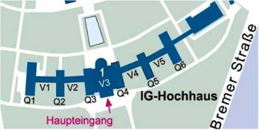

# IG Farbenhaus

    

Falls dies deine erste Station der Campus Tour ist und Du noch nicht weißt, was dich erwartet und wie der Ablauf ist, dann kannst Du auf unserer [Startseite](https://campus-tour.github.io) alles Wichtige nachlesen! Falls Du dich allerdings schon auskennst, dann kannst Du hier direkt weitermachen, viel Spaß!  

Nun bist Du am IG-Farben-Haus angekommen. Zunächst einmal solltest Du in das
Gebäude gehen... bis Du in der Eingangshalle mit Blick auf die Eisenhower-Rotunde, dem verglasten Rundpavillon, angekommen bist. Das IG-Farben-Haus
ist das älteste und gleichermaßen geschichtsträchtigste Gebäude des Campus.
Es ist von einer solch erinnerungspolitischen Relevanz, dass es eine studentische
Initiative gibt, die die Umbenennung des gesamten Campus in den „IG-Farben-
Campus“ fordert. Trotz der bewegten Historie des Gebäudes wird es seit 2001 im
Rahmen der Universität zu einem Ort der Offenheit, des Austausches und der
Wissenschaft   umstrukturiert   und   ist   heute   das   Domizil   der
geisteswissenschaftlichen Fachbereiche der Universität.  
Das Gebäude besteht aus sechs Flügeln, die durch einen leicht geschwungenen
Flur miteinander verbunden sind (siehe unten). Die äußeren Flügel (Q1 & Q6)
beherbergen ausschließlich die Institutsbibliotheken. In allen anderen Teilen des
Gebäudes,   einschließlich   des   östlichen   Nebengebäudes   (NG),   befinden   sich
Seminarräume, Dienstzimmer, Sekretariate und Konferenzsäle.

Nun hast Du dieses eindrucksvolle Gebäude vor Dir und die Wahl: 
Möchtest Du über die Geschichte des Hauses sofort mehr erfahren 
oder zunächst einmal mit dem berühmtberüchtigten Paternoster-Aufzug fahren? 
Die Entscheidung liegt bei Dir: Gehe vom Haupteingang aus gesehen die Treppen hinauf und in den linken Flügel 
des Gebäudes, um die Geschichte des Gebäudes und des Campus Westends zu ergründen 
oder gegenteilig nach rechts, um zunächst einen nostalgischen Ritt im Paternosteraufzug 
zu wagen. Möchtest Du jedoch zunächst eine Pause machen, dann setze dich doch in das 
Café in der imposanten Eisenhower-Rotunde und genieße den Ausblick. 

PS: Falls Deine Kraftreserven schon etwas ausgelaugt sind, dann empfehlen wir Dir, 
zumindest einen Blick auf die nationalsozialistische Vergangenheit des Gebäudes zu 
werfen und den Weg nach links zu gehen, denn dort befindet sich auch das nächste Rätsel...

[←: Nationalsozialistische Vergangenheit](IG_Farbenhaus_Nationalsozialistische_Vergangenheit.md)

[→: Paternosteraufzug](IG_Farbenhaus_Paternoster.md)

[↑: Eisenhower-Rotunde Café](IG_Farbenhaus_Eisenhower_Rotunde_Cafe.md)

### Nächste Station: _///beurteilt.hinterher.touristen_   

