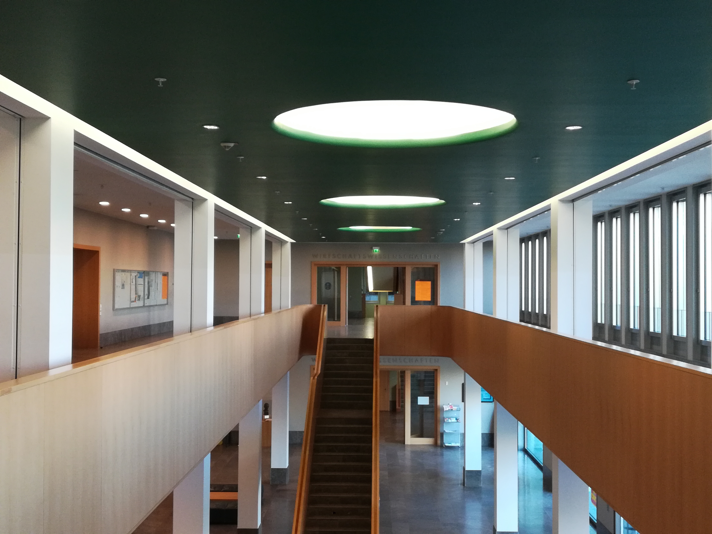

# Institut für Rechts- und Wirtschaftswissenschaften

    

Falls dies deine erste Station der Campus Tour ist und Du noch nicht weißt, was dich erwartet und wie der Ablauf ist, dann kannst Du auf unserer [Startseite](https://campus-tour.github.io) alles Wichtige nachlesen! Falls Du dich allerdings schon auskennst, dann kannst Du hier direkt weitermachen, viel Spaß!  

Vor Dir befindet sich das Recht- und Wirtschaft-Gebäude, kurz RuW. Hier finden vor allem Forschungen und Kurse des Fachbereichs 01 (Rechtswissenschaft) und des Fachbereichs 02 (Wirtschaftswissenschaften) statt. 
Von insgesamt 45521 Studierenden im Jahr 2020 an der Goethe Universität studieren die meisten Wirtschaftswissenschaften (5814 Studierende), dicht gefolgt von Mathematik und Informatik (5399 Studierende) und Rechtswissenschaft (4746 Studierende). Zu den beliebtesten Studiengängen gehört demnach Wirtschaftswissenschaften – im folgenden Rätsel wird daher nach einer der zahlreichen Lehrenden gefragt. 

### Die gesuchte Person…
*	wurde in dem Jahr geboren, als der erste wissenschaftliche Taschenrechner HP-35 erfunden wurde.
*	erhielt 1998 ihr Diplom in Volkswirtschaftslehre in ihrer Geburtsstadt. 
*	lehrt seit 2009 an der Goethe Universität Frankfurt am Main Wirtschaftswissenschaften und hat eine Professur in Makroökonomie und Entwicklung inne.
*	wurde 2018 für ihre international angesehene Arbeit zu unterschiedlichen Wertehaltungen zwischen DDR-Sozialisierten Bürger:innen und west-sozilaisierten Bürger:innen mit dem Leibniz-Preis ausgezeichnet. Hier bestätigte die gesuchte Person die These, dass ökonomische Präferenzen veränderbar sind und in Abhängigkeit zum ökonomischen System stehen, in dem das Individuum lebt.  
*	ist im Jahr 2021 als Mitglied in die Nationale Akademie der Wissenschaften Leopoldina aufgenommen worden.
*	trägt in ihrem Nachnamen ein in Deutschland heimisches Tier. 

Der zweite Buchstabe des Nachnamens der gesuchten Person ist der Lösungsbuchstabe der Station.

  
Entdecke das RUW auch von innen! Hier gibt es viel zu entdecken. An gewissen Orten findest Du spannende Infotafeln zu bedeutenden Wissenschaftler:innen des Rechts und der Wirtschaft.
 

  
Im 1.OG befindet sich beispielsweise eine Büste zu Reinhard Selten, der an der Goethe Universität Mathematik und Volkswirtschaftslehre studierte und 1994 mit dem Alfred-Nobel-Gedächtnispreis für Wirtschaftswissenschaften ausgezeichnet wurde.

### Nächste Station: _///gesetz.wohnort.schieben_
Du kannst zudem [hier](https://campus-tour.github.io/campus-garten.html) klicken, um zur Seite der nächsten Station zu gelangen ;)

